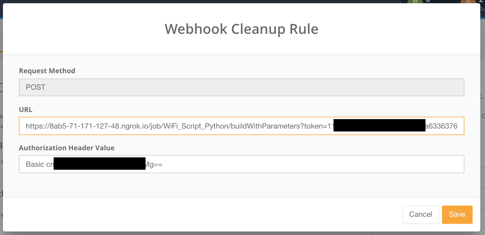
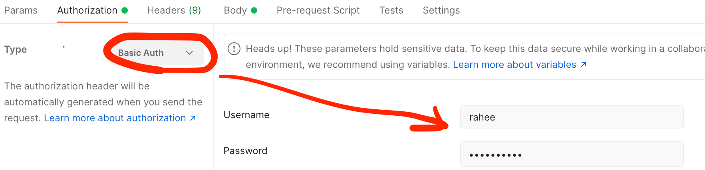
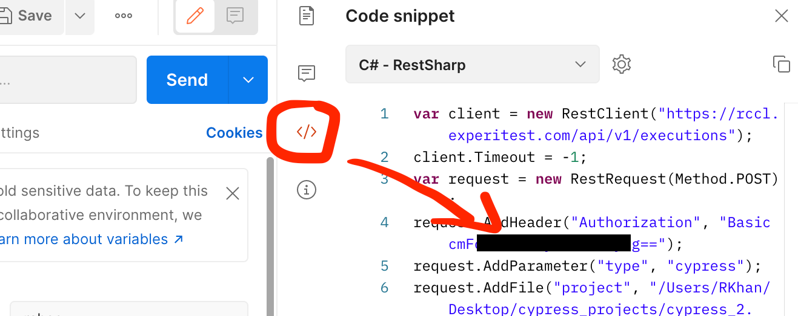
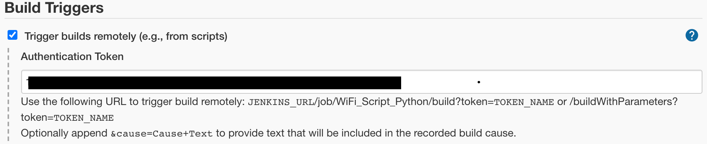
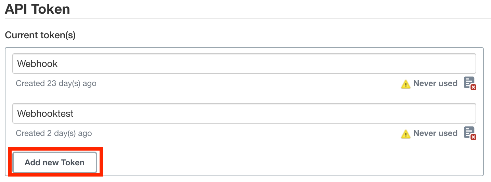
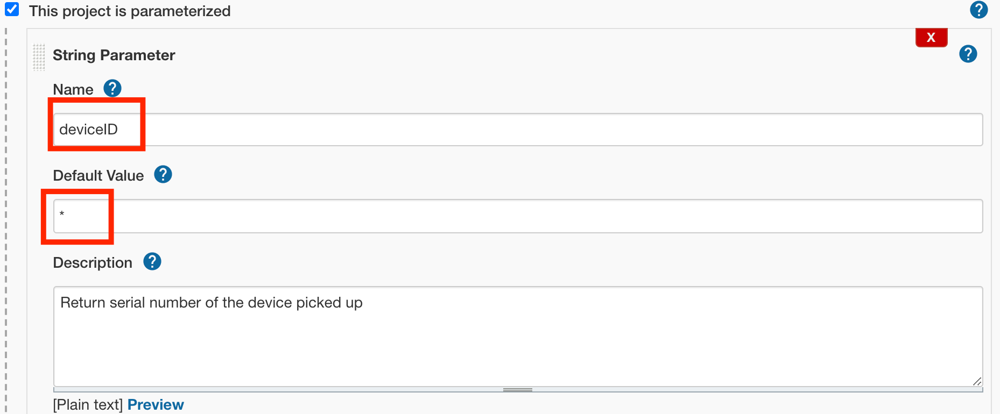
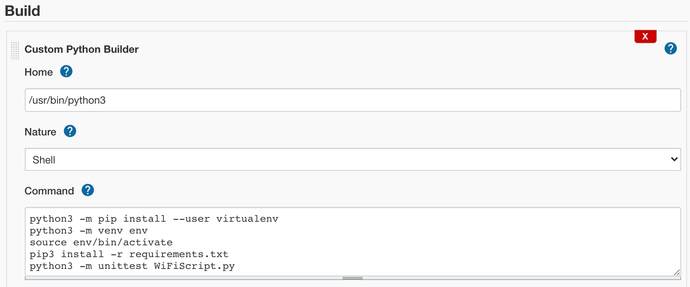
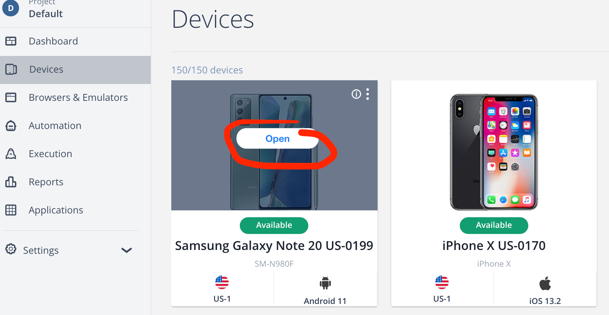
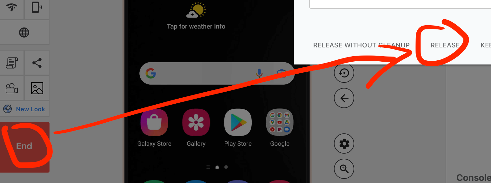
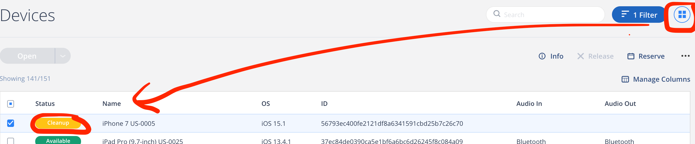

# Custom Webhook Cleanup - SeeTest Cloud (_Digital.ai's Continuous Testing platform_)

## Introduction

The purpose of this script is to allow us to perform custom steps on mobile devices hosted on a SeeTest Cloud instance.

This script will be triggered as part of the cleanup mechanism.

We already have an official documentation page regarding the Webhook Cleanup feature, [find the documentation page here](https://docs.experitest.com/display/COM/Webhook+Cleanup).

This guide will help you understand the complete setup including third party tools used such as Jenkins.

## Tools 

The following tools were used for this integration:

**Programming Language**

I used Python, as it is quicker to compile the code and have a test running. The importance of a cleanup is to do its job quickly and efficiently. I initially started with Java with Maven, and the time it took to compile the code and then run the test was significantly higher, making this inefficient.
I used Python3 specifically, as some of the approaches we’ll take is slightly different for Python 2 vs 3. And generally speaking, using a newer version is also recommended.

**Framework**

Appium was used as the choice of automation framework, and also unittest to define the tests in a better way. We’ll have a closer look at an example later on.

**PyCharm**
While you can write Python code in other IDEs, I choose PyCharm as it is still relatively lightweight and allows for easy coding in Python.

**Jenkins**

Jenkins was used as my personal choice for running the code, but any other CICD tool would be able to do the same job.
Here are some example integrations with other tools: [Continuous Integrations](https://docs.experitest.com/display/TE/Continuous+Integrations)

**GitHub**

GitHub was used as my personal choice for hosting a code base in a repository, but any other tool would achieve the same thing.

**Git**

As I am using GitHub, it made sense to also use Git to perform push / pull changes to the repository in GitHub.

## Prerequisites:

1. Populate the relevant fields in the **config.properties** file, the following fields are available:

```
[seetest_authorization]
access_key_admin=<>
access_key_cleanup=<> - Can be obtained by logging in to SeeTest Cloud as Cloud Admin > Settings > Device Policies > Click on Key Icon to reveal Access Key of Cleanup User

[seetest_urls]
cloud_url=http://<seetest_cloud_url>:<port>
end_point=/api/v1/devices
wd_hub=/wd/hub

[tags]
good_tag_value=GoodWiFi - String value of tag we want to provide to a device if it is connected to CORRECT WiFi
bad_tag_value=BadWiFi - String value of tag we want to provide to a device if it is connected to INCORRECT WiFi

[wifi]
wifi_name=WiFiName - String value of the WiFi connection we are looking for on the device
```

2. Enable Webhook Cleanup in SeeTest Cloud on a global level
   1. Login as a Cloud Admin
   2. Navigate to **Settings > Device Policies**
   3. Enable Webhook Cleanup
   
    In the configure section, we need to populate the relevant fields:


   

   The URL is the full JOB URL (_Further down in this README.md, we'll see how to generate a token_):

```
https://<jenkins_url>/job/<job_name>/buildWithParameters?=Token
```

  And the Authorization Header Value is Cloud Admin credentials. If you don't have this format handy, a quick and easy way is to open up Postman, and populate the Authorization field like this choosing **Basic Auth**:

  

  When exporting this to code, it will show the proper format (_Code Export Language does not matter_):

  

3. Enable Webhook Cleanup in SeeTest Cloud on a project level
   1. Login as a Cloud Admin
   2. Navigate to **Settings > Project > Select your Project > Manage**
   3. Navigate to **Device Policies**
   4. Enable Webhook Cleanup

  Enabling it on a Project Level allows us to invoke the CICD Job when cleanup is triggered on the devices for that project.   

4. Create a CICD Job (_I used Jenkins, Freestyle project_)

    There are a couple of things to keep in mind:


   a. since we are trying to invoke the job automatically as soon as a device is released, we need to configure the job to allow to be triggered remotely using Auth Token:

   


   b. Authentication Token is generated from Manage Jenkins > Manage Users > Select User > Configure. Under Configure, Create a new API Token (_Should be on an admin role or user who created the project_):
   
   

   Populate the Token in the Jenkins Job under **Build Triggers > Trigger Builds Remotely**, as well as in the **Webhook Cleanup Rule** as per Step 1.

   c. We need to parameterize the build by enabling "This project is parameterized". For this I installed EnvInject Plugin.    

   

   

   These will be important and referenced in the code **WiFiScript.py**, they are defined in the following way:

```
import os
       
uid = os.getenv("deviceID")
operating_system = os.getenv("deviceOS")
```

   They can then be referenced respectively depending on what we need to do in the script. When initializing the session, since we don't know which device it will pick to begin with, we need to let the Jenkins job device that, depending on which device is getting cleaned up at the time. This is how should define the device setup in the capabilities:


```
capabilities['udid'] = '%s' % uid
```

   d. When I tried to invoke the code, I was getting an error message regarding needing a CrumbIssuer. 

   CrumbIssuer represents an algorithm to generate a nonce value, known as a crumb, to counter cross site request forgery exploits. Crumbs are typically hashes incorporating information that uniquely identifies an agent that sends a request, along with a guarded secret so that the crumb value cannot be forged by a third party. 

   According to online sources, there are a number of ways to tackle this, I choose the easiest option to simply disable the csrf check from Jenkins by running a script (_Not recommended in production_)

   From Manage Jenkins > Script Console, I ran following snippet:   
       
```           
import jenkins.model.Jenkins
def instance = Jenkins.instance
instance.setCrumbIssuer(null)
```
   
   e. As I am using Python, I needed to install a plugin to allow Python script to be triggered. 
   
   I used [ShiningPanda's Custom Python Builder plugin](https://plugins.jenkins.io/shiningpanda/) for this, but any other plugin that allows for Python to be triggered allows for the same approach.
   
   Under the Jenkins build configuration, I added a build step with the following input:
   
   
   
   Under "Home" I have put the local path of where my Python3 resides.

   Under "Nature" I have **Shell** selected for executing shell script

   Under "Command" is the commands required to setup the WiFiScript.py and trigger it.
   
   I am installing **virtualenv**, so that I can spin an instance up to run the test under:
```
python3 -m pip install --user virtualenv
```

   I am then initializing the instance
```
python3 -m venv env
```

   And activating the instance
```
source env/bin/activate
```

   To make life easier, I have stored all the required packages under **requirements.txt**, before running the test, it will install the relevant packages needed (_appium / selenium, and more_)
```
pip3 install -r requirements.txt
```

   This will run the test using [unittest](https://docs.python.org/3/library/unittest.html) framework 
```
python3 -m unittest WiFiScript.py
```


## Invoking the Cleanup Mechanism

   Considering the setup is done, the cleanup mechanism can now be invoked. To test this out, we can login to the SeeTest Cloud instance in a project where Webhook Cleanup is enabled.

   Open any device from the Devices Page:
   
   
   
   Once opened, Release the device:
   
   
   
   This will automatically trigger the cleanup process:
   
   We can also see this by switching the Devices Page view to a List View:
   
   